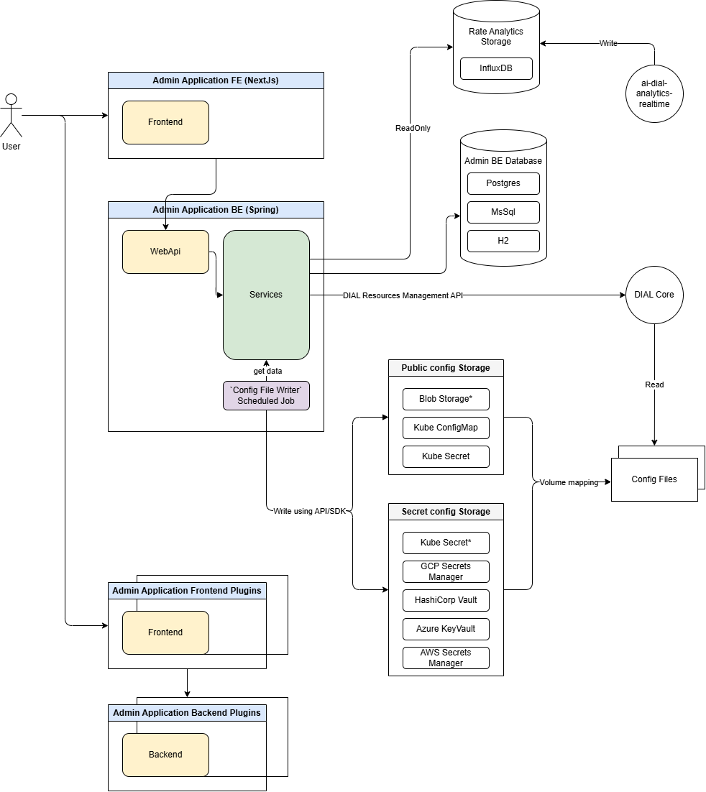

# AIDIAL Admin Panel Backend

[](https://www.oracle.com/java/technologies/javase/jdk17-archive-downloads.html)
[](https://spring.io/projects/spring-boot)
[](LICENSE)

Admin Panel API for AIDIAL Core. This API exposes REST endpoints to manage dial-core configuration.
The system uses a database (H2/PostgreSQL) as persistent storage and includes a scheduled job that produces a JSON file compatible with dial-core config format.
This file can be used by aidial-core if listed in the `config.files` configuration property.

For more information about aidial-core, visit the [aidial-core repository](https://github.com/epam/ai-dial-core/blob/development/README.md) or [DIAL Documentation](https://docs.dialx.ai/).

## Table of Contents

- [AIDIAL Admin Panel Backend](#aidial-admin-panel-backend)
  - [Table of Contents](#table-of-contents)
  - [Prerequisites](#prerequisites)
  - [Features](#features)
  - [REST API](#rest-api)
  - [Configuration](#configuration)
    - [Authentication](#authentication)
    - [Keycloak](#keycloak)
  - [Managing Existing Dial Core Configurations](#managing-existing-dial-core-configurations)
  - [Getting Started](#getting-started)
    - [Run Application with Gradle](#run-application-with-gradle)
    - [Run with Docker](#run-with-docker)
      - [Build Docker Image](#build-docker-image)
      - [Run Container](#run-container)
    - [Run Locally with Docker Compose](#run-locally-with-docker-compose)
  - [Security](#security)
  - [Contributing](#contributing)
  - [License](#license)

## Prerequisites

- Java 17 or higher
- Gradle 7.x or higher
- Docker and Docker Compose (for containerized deployment)

## Features

- RESTful API for managing dial-core configurations
- RESTful API for managing dial-core public resources
- RESTful API for managing dial-core publications
- Multiple authentication methods (Basic Auth and JWT)
- Multiple database support for internal storage (Basic Auth and JWT)
- Keycloak/AzureAD integration for identity management
- Configuration file generation and management
- DIAL core config file expot in multiple destinations (File on filesystem/Kubernetes ConfigMap/Kubernetes Secret/Azure Keyvault/Hashicorp/AWS Vault/GCP secrets manager)
- Containerized deployment support
- Health monitoring endpoints
- Metrics query API with InfluxDB integration [https://github.com/epam/ai-dial-analytics-realtime]

## REST API

The Admin Panel API exposes REST endpoints under the `/api/v1` prefix.
Sample REST API requests can be found in [AdminPanel.http](docs/sample/http-requests/AdminPanel.http).

## Configuration

Complete list of configuration properties can be found [here](docs/configuration.md).

### Authentication

**Security is disabled for default configuration. It's highly not recommended to use default configuration 
for production environment.** 

For production environment:
- Set `CONFIG_REST_SECURITY_MODE` environment variable with either `oidc` or `basic` value
- (optional) Set `MS_SQL_SERVER_OPS` environment variable with `encrypt=true;` value if application is launched with sql server.

The system supports two authentication methods:

1. **Basic Authentication** (Default)
   - Configure username and password in `application.properties`:
     ```properties
     spring.security.user.name=your_username
     spring.security.user.password=your_password
     ```
   - Enable with:
     ```properties
     config.rest.security.mode=basic
     ```

2. **JWT Authentication**
  - Configure Identity Provider settings in the configuration file application-iam-providers.properties separately for
    each provider (example for Azure Provider):
     ```properties
      providers.azure.issuer=your_issuer
      providers.azure.jwk-set-uri=your_jwk_set_uri
      providers.azure.aliases=your_aliases
      providers.azure.audiences=your_audiences
      providers.azure.role-claims=your_role_claims
        ```
   - Enable with:
     ```properties
     config.rest.security.mode=oidc
     ```

### Keycloak

Keycloak can be used as a simple IDP replacement for local test/development.
Please refer to the [Keycloak setup guide](docs/keycloak_configuration.md) for more information.

## Managing Existing Dial Core Configurations

The system creates an empty configuration. To utilize existing Dial Core configurations:

1. Import configuration file in the AIDIAL admin panel using special import endpoint

## Getting Started

### Run Application with Gradle

#### Run with H2 database

From the project's root directory:

Execute 
```bash
python secrets-utils/keys_generator.py
```
to get values for 
- `H2_DATASOURCE_PASSWORD`, 
- `H2_DATASOURCE_MASTER_KEY`, 
- `H2_DATASOURCE_ENCRYPTED_FILE_KEY` 

environment variables.

Set those environment variables and execute
```bash
./gradlew bootRun
```

#### Run with POSTGRES database

From the project's root directory:

Execute
```bash
cd local_env
docker-compose up postgres
```
to start postgres container.

Set `DATASOURCE_VENDOR=POSTGRES` environment variable to run application with postgres database.

Execute
```bash
./gradlew bootRun
```

#### Run with MS_SQL_SERVER database

From the project's root directory:

Execute
```bash
cd local_env
docker-compose up sqlserver
```
to start sqlserver container.

Set `DATASOURCE_VENDOR=MS_SQL_SERVER` environment variable to run application with sql server database.

Execute
```bash
./gradlew bootRun
```

### Run with Docker

#### Build Docker Image

```bash
docker build . -t epam/ai-dial-admin-backend:local
```

#### Run Container

```bash
docker run -p 8080:8080 <image:tag>
```

Verify the installation:

```bash
curl -X GET --location "http://localhost:8080/api/v1/health"
```

Expected response:
```json
{
  "status": "UP"
}
```

### Run Locally with Docker Compose

Use the predefined setup in [docker-compose.yml](local_env/docker-compose.yml)

#### Start local env
```bash
docker-compose up
```

#### Stop local env
```bash
docker-compose down
```

>📝 **Note:**
> 
> If there is need to start local env with published image, `local` image tag should be changed to preferred one 
> in [docker-compose.yml](local_env/docker-compose.yml) for `admin-back` container.
> 
> See all published images [here](https://hub.docker.com/r/epam/ai-dial-admin-backend).

### Components diagramm



## Security
For information about security practices and reporting security issues, please refer to our [Security.md](Security.md) document.

## Contributing

We welcome contributions! Please see our [Contributing Guide](CONTRIBUTING.md) for details.

## License

This project is licensed under the Apache License 2.0 - see the [LICENSE](LICENSE) file for details.