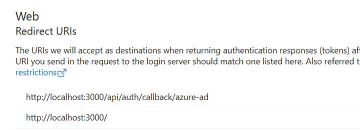
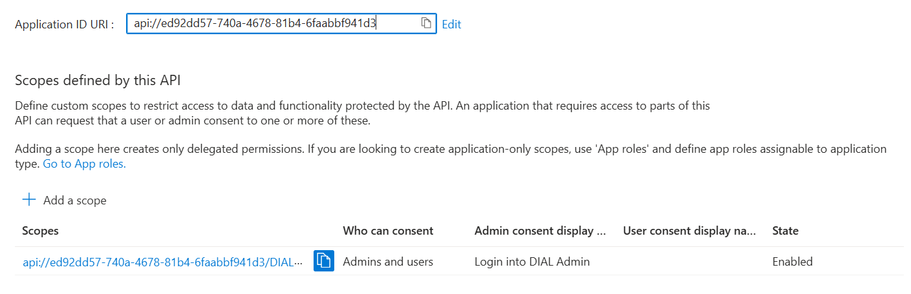
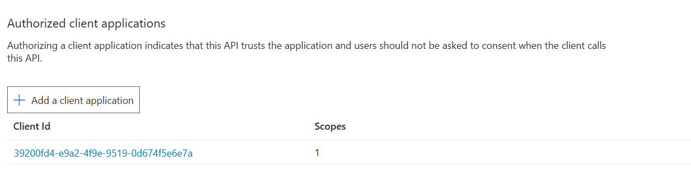
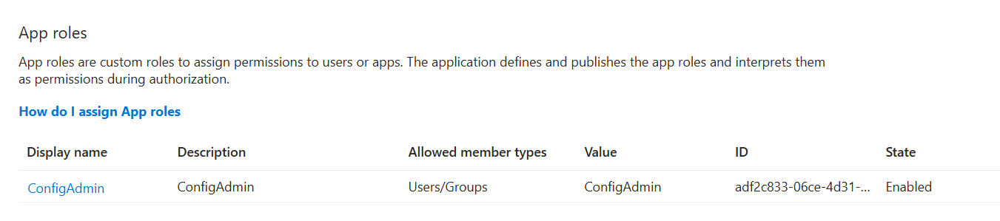
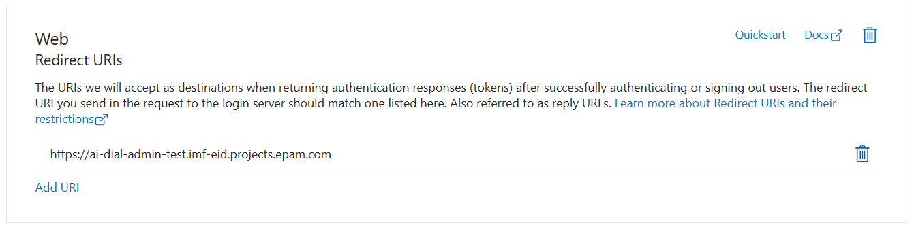
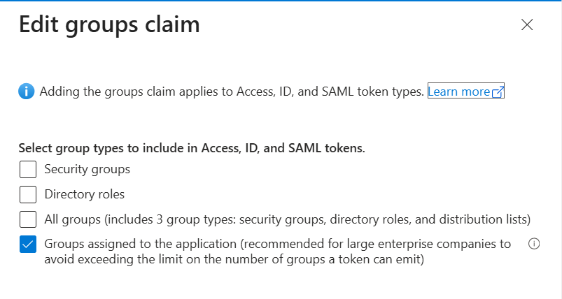

# Azure Provider Configuration Guide for Admin Application

This guide details the steps to configure Azure AD App Registrations for the `ai-dial-admin` application environment.

---

## 1. Configure App Registrations

### a. Create the Client App Registration

**Name**: `Ai.Dial.Admin.SPA.TST`  
Used by the frontend application to authenticate via Azure AD.

Steps:

1. Go to **Azure Portal > App registrations** and create a new registration.
2. Name the app `Ai.Dial.Admin.SPA.TST`.
3. After creation, navigate to **Certificates & secrets**:
   - Create a **client secret**.
   - Note the value – it will be used in your frontend deployment as:
     - `AuthADminAzureAADClientSecret`
4. Navigate to the **Authentication** tab:
   - Add a **Web** platform.
   - Set the **redirect URI** to:
     ```
     https://<your_admin_dns>/api/auth/callback/azure-ad
     ```


---

### b. Create the API App Registration

**Name**: `Ai.Dial.Env.Tst`  
Used to expose APIs and assign user/group roles.

Steps:

1. Go to **Azure Portal > App registrations** and create a new registration.
2. Name the app `Ai.Dial.Env.Tst`.

#### i. Configure API Scope
- Navigate to **Expose an API** tab.
- Set the **Application ID URI** (e.g., `api://<app_client_id>`).
- Add a new **scope** for admin login:
  - Name: `admin`
  - Who can consent: Admins and Users
  - Description: Scope for admin access.

#### ii. Authorize Client Application
- Under **Expose an API**, add `Ai.Dial.Admin.SPA.TST`'s **client ID** as an **Authorized client application**.

#### iii. Add Custom App Role
- Go to **App roles** and add a new role:
  - Name: `ConfigAdmin`
  - Allowed member types: **Users/Groups**
  - Description: Application configuration administrator

#### iv. Configure Authentication
- Navigate to **Authentication** tab.
- Add a **Web** platform with the redirect URI https://<your_admin_dns>/

#### v. Token Configuration
- Go to the **Token Configuration** tab.
- Add **Group Claims**:
- Include groups in token (required for role assignments)

#### vi. Assign Users or Groups
- Go to **Enterprise Applications**.
- Find `Ai.Dial.Env.Tst`, open it.
- Under **Users and Groups**, assign users/groups with the **ConfigAdmin** role.

---

## Security Configuration

| Environment Variable Name| Value | Description                                                                                 |
|--------------------------|-------|---------------------------------------------------------------------------------------------|
| SECURITY_ALLOWED_ROLES | ConfigAdmin | Ai.Dial.Env.Tst role name |
| SECURITY_JWT_JWKS_URI | https://login.microsoftonline.com/common/discovery/v2.0/keys | URI for JSON Web Key Set |
| SECURITY_JWT_ACCEPTED_ISSUERS | `<AZURE_TENANT_ID>` | Azure directory id |                                                  |
| DIAL_ADMIN_CLIENT_ID | `<AZURE_CLIENT_ID>` | Ai.Dial.Env.Tst Client id   |

---

## Notes

- Replace `<your_admin_dns>` with your actual DNS.
- Ensure role assignments and group memberships propagate correctly.
- Validate authentication flows using Azure AD test users or service accounts.