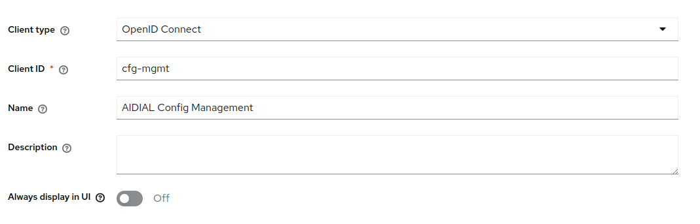
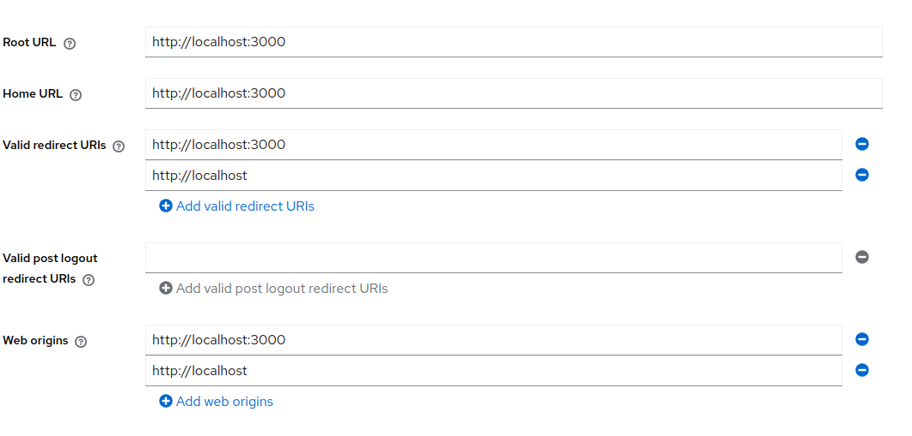
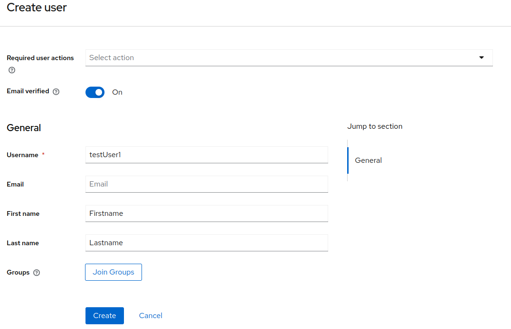

# Keycloak configuration for local IDP integration
Run 
```shell
docker-compose up
```
to spin up Keycloak.

- Go to http://localhost:8888. Use default credentials (admin/admin) to log in.

- Go to Clients -> Create Client and start filling fields as follows.

- Click "Next" and on "Capability config" page enable "Client Authentication" and click "Next".

- Fill URLs

- And click "Save"

- Open newly created Client "cfg-mgmt" and go to "Roles" tab.
Create new role "ConfigAdmin".
- Now switch to "Credentials" tab and copy "Client Secret". It will be needed for IDP configuration in ai-dial-admin-backend.
- On the left pane go to "Users" and create new User.
  
- Click create and go to "Credentials" tab. Set the password for that user and set "Temporary" flag to false
- Go to "Role Mapping" and click "Assign role". Search for "ConfgiAdmin" role created before. Assign selected role.
- Now go to ai-dial-admin-backend application.properties and configure Identity Provider as follows:
    * application.properties
```properties
config.rest.security=oidc
```

* application-iam-providers.properties

```properties
providers.keycloak.issuer=http://localhost:8888/realms/master
providers.keycloak.jwk-set-uri=http://localhost:8888/realms/master/protocol/openid-connect/certs
providers.keycloak.audiences=account
providers.keycloak.roles-claims=resource_access.*.roles
```

To use configured IDP with Sample HTTP Client located [here](sample/http-requests/AdminPanel.http) you need to set [env variables](sample/http-requests/http-client.env.json)
Replace `{client_secret}` with client secret that you copied from "Client Secret" tab
```json
{
  "dev": {
    "Security": {
      "Auth": {
        "keycloak": {
          "Type": "OAuth2",
          "Grant Type": "Authorization Code",
          "Client ID": "cfg-mgmt",
          "Redirect URL": "http://localhost:3000",
          "Auth URL": "http://localhost:8888/realms/master/protocol/openid-connect/auth",
          "Token URL": "http://localhost:8888/realms/master/protocol/openid-connect/token",
          "Client Secret":"{client_secret}"
        }
      }
    }
  }
}
```
Now you are ready to user Authorization based on JWT token. Well done!


## Obtaining a Token from Keycloak

To easily obtain tokens from Keycloak for testing or troubleshooting, you can use the provided Postman collection: [`docs/sample/http-requests/Keycloak.postman_collection.json`](sample/http-requests/Keycloak.postman_collection.json).

**Follow these steps:**

1. **Configure Environment Variables**  
   Set the `KEYCLOAK_HOST` and `REALM` variables in your Postman environment to match your Keycloak instance.

2. **Initiate the Authorization Flow**  
   Open the `auth` request from the Postman collection in your browser. Complete the authentication process as prompted.

3. **Retrieve the Authorization Code**  
   After successful authentication, you will be redirected. Copy the `code` parameter from your browser's address bar.

4. **Set Up the Token Request**  
   - Paste the copied `code` value into the `AUTH_CODE` variable in the `token` request within Postman.
   - Set the `KEYCLOAK_SECRET_DIAL_ADMIN` variable to the client secret you obtained from the Keycloak admin console.

5. **Request the Token**  
   Execute the `token` request in Postman. You should receive an access token in the response.

> **Note on PKCE (Proof Key for Code Exchange):**  
> If your client is configured to use PKCE, the authorization request may require two additional parameters: `code_challenge` and `code_challenge_method`.  
> - You can generate a `code_verifier` and its corresponding `code_challenge` using an online tool such as [PKCE Generator](https://tonyxu-io.github.io/pkce-generator/).
> - During the authorization request, include the generated `code_challenge` and `code_challenge_method` parameters.
> - When making the token request, include the original `code_verifier` parameter.
> - These PKCE-related parameters are available as optional fields in the provided Postman collection.

This process will help you quickly obtain and test JWT tokens from your Keycloak setup.